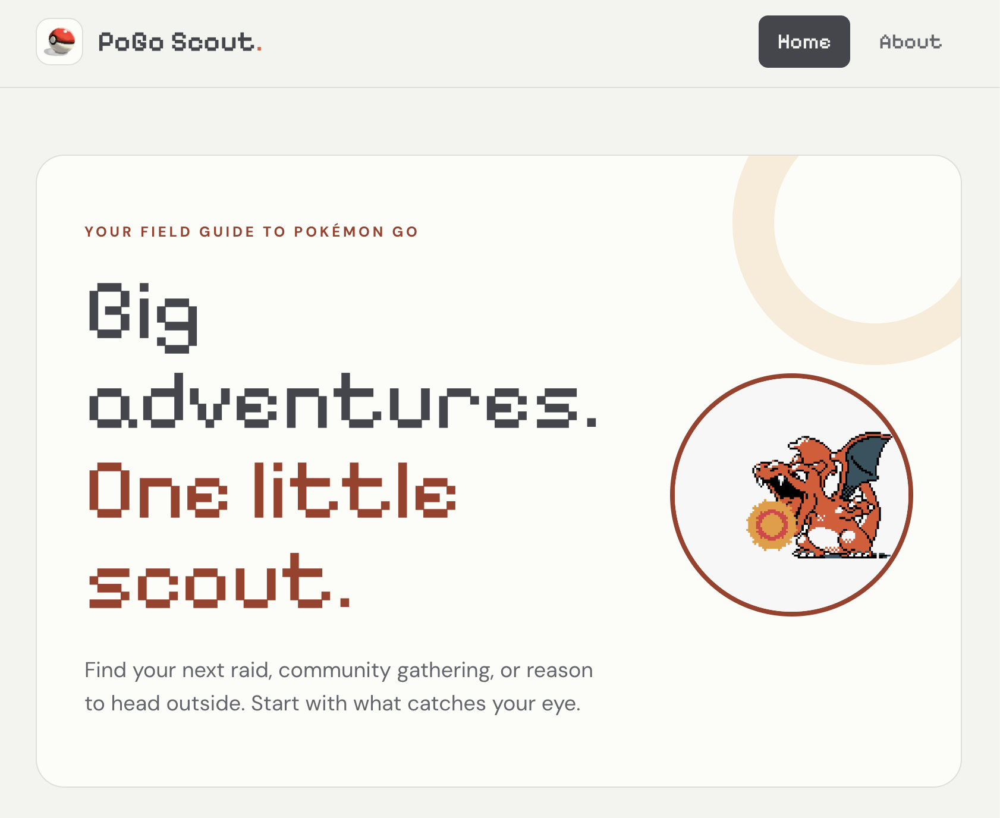

# POGO Scout

A Pokémon GO event tracker for finding what’s happening now, checking upcoming events, and adding start reminders to your calendar.

I built this because I play Pokémon GO and wanted a simple way to keep up with events and share them with friends.

[Open the app](https://pogo-events.onrender.com/)



## Features

- Separate sections for events happening now and upcoming events.
- Filter by multiple event categories.
- Events sorted by start time.
- Download calendar reminders for upcoming events.
- Responsive layout for phones and desktop screens.

## Built with

React, TypeScript, Tailwind CSS, Node.js, Express, and Vite. Calendar files are generated with the `ics` library. The app is hosted on Render.

## How it works

The React frontend requests events from an Express endpoint at `/api/events`. The server fetches the data from ScrapedDuck and caches it in memory for 10 minutes. Requests reuse that data while the cache is fresh; the next request after it expires triggers a new fetch.

Filtering and sorting happen in the browser, so changing categories doesn’t make another request to the event source.

In deployment, Express serves both the API and the built React app from the same address.

## A few design decisions

**Short calendar reminders:** Some Pokémon GO events last weeks or months. Instead of filling that entire period on a calendar, the app creates a 15-minute entry at the event’s start, with a requested alert 30 minutes beforehand.

**Local and global times:** Calendar exports preserve the distinction between events that start at the same local time for each player and events that start at one fixed time worldwide.

**Simple caching:** The event feed doesn’t need a database yet. An in-memory cache reduces repeated requests, with the tradeoff that it resets when the server restarts.

## Run locally

Use Node.js 24 and npm.

```bash
git clone https://github.com/jjoseramoss/pogo-events.git
cd pogo-events
npm ci --prefix client
npm ci --prefix server
```

Start the backend in one terminal:

```bash
npm --prefix server run dev
```

Start the frontend in another:

```bash
npm --prefix client run dev
```

Open the local URL printed by Vite, usually `http://localhost:5173`. Vite forwards `/api` requests to the backend on port 3000.

To run the built app:

```bash
npm --prefix client run build
npm --prefix server run build
npm --prefix server start
```

Stop the development backend first if it’s already using port 3000. Then open `http://localhost:3000`.

## Limitations

- Event accuracy and freshness depend on the source feed.
- Downloaded calendar entries don’t automatically update when an event changes.
- Calendar imports and alerts depend on the calendar app and notification settings.
- Events with insufficient date information may not appear in the event sections.

## Credits

Event data comes from [LeekDuck](https://leekduck.com/) through [ScrapedDuck](https://github.com/bigfoott/ScrapedDuck).

POGO Scout is an independent fan project and is not affiliated with Pokémon GO or its owners.
